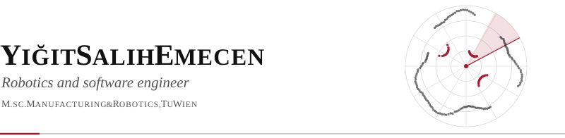

<picture>
  <source media="(prefers-color-scheme: dark)" srcset="assets/header-dark.svg">
  
</picture>

  <a href="mailto:ysalih.emecen@gmail.com">ysalih.emecen@gmail.com</a> &nbsp;&bull;&nbsp;
  <a href="https://www.linkedin.com/in/yigit-emecen-509b7b1b7/">linkedin.com/in/yigit-emecen-509b7b1b7</a>

<picture>
  <source media="(prefers-color-scheme: dark)" srcset="assets/profile-dark.svg">
  
</picture>

Robotics and software engineer (M.Sc. Manufacturing & Robotics, TU Wien) who builds perception, simulation and teleoperation stacks for industrial mobile manipulators in ROS 2. At the TU Wien Institute of Production Engineering and Photonic Technologies (IFT), I integrate the 5G-connected GIGABOT platform and coordinate the seven-partner Erasmus+ project AI.ROBOTECH. I pair embedded-systems depth (Jetson, STM32, ESP32) with the planning discipline needed to deliver EU-funded research across institutions.

<picture>
  <source media="(prefers-color-scheme: dark)" srcset="assets/education-dark.svg">
  
</picture>

**Technische Universität Wien (TU Wien)**, Vienna, Austria  
*M.Sc. Manufacturing & Robotics*, Mar 2026 – present

**İstanbul Ticaret Üniversitesi**, Istanbul, Türkiye  
*B.Sc. Electrical & Electronics Engineering*, Aug 2020 – Jul 2025

**FH Technikum Wien**, Vienna, Austria  
*Exchange semester, Electronics Engineering*, Feb 2024 – Jul 2024

<picture>
  <source media="(prefers-color-scheme: dark)" srcset="assets/experience-dark.svg">
  
</picture>

**TU Wien, Institute of Production Engineering and Photonic Technologies (IFT)**, Vienna, Austria  
*Research Engineer, Software & Robotics, and Project Coordinator (working student)*, Oct 2025 – present

- **GIGABOT, 5G-enabled mobile manipulation platform.** Merged six subsystem repositories into one Dockerized ROS 2 workspace as sole integrator and migrated the stack from x86 to ARM (NVIDIA Jetson Thor) to run onboard the robot.
- Wrote ROS 2 drivers for the DMG Mori AMR and the Fanuc arm, and built a Gazebo digital twin from CAD-derived URDF models.
- Integrated base and arm into a private 5G network for real-time teleoperation, and added an Ensenso 3D camera with a live point-cloud view in the operator panel.
- **AI.ROBOTECH, Erasmus+ KA220-HED.** Coordinate the seven-partner project on safe autonomous robotics education with ROS 2: partner and grant agreements, lump-sum reporting rules, EU visual-identity requirements, and the transnational kick-off in Vienna.

**İstanbul Ticaret University**, Istanbul, Türkiye  
*Software & Robotics intern*, Jul 2025 – Aug 2025

- Built a custom 360° LiDAR (TF-Luna ToF sensor, ESP8266, magnetic encoder) with real-time 2D mapping at 240 Hz, and a robot platform with encoders, IMU and PID motion control.

<picture>
  <source media="(prefers-color-scheme: dark)" srcset="assets/selected-projects-dark.svg">
  
</picture>

**[PolarBot](https://github.com/YigitSalihEmecen/PolarBot)**, *WiFi-controlled polar plotter on an ESP8266*, Sep 2026  
A €5 machine with fully 3D-printed parts. Firmware converts Cartesian G-code to polar motion in real time, with live-tunable backlash compensation, WebSocket streaming and a build-free browser control panel. Open source (MIT).

**[YellowBoy](https://github.com/YigitSalihEmecen/YellowBoy)**, *Game Boy emulator for ESP32 without PSRAM*, May 2026 – present  
Bare-metal port of Peanut-GB that fits ROM banking, frame buffer and emulator state into internal SRAM. Analog DAC audio, I²C controller, SD-card ROM loading; verified at full speed on 10+ commercial titles.

**[Open LiDAR](https://github.com/YigitSalihEmecen/Open_LiDAR)**, *360° spinning LiDAR and robot platform*, Sep 2024 – Dec 2025  
Open-sourced firmware, CAD models and documentation. Slip ring removed to cut cost, 240 Hz real-time mapping with encoder-based odometry. Grew out of the [graduation project](https://github.com/YigitSalihEmecen/ToF_2D_Scanning_LiDAR).

**[Wireless MIDI Controller](https://github.com/YigitSalihEmecen/esp8266-Wireless-MIDI-Control)**, *ESP8266 and MPU6050 motion sensor*, Jun 2023  
A tilt-sensing device that streams MIDI over WiFi (RTP-MIDI), used to control guitar effect pedals in real time.

<picture>
  <source media="(prefers-color-scheme: dark)" srcset="assets/more-projects-dark.svg">
  
</picture>

- **Browser tools:** [Engine Sim](https://yigitsalihemecen.github.io/Engine_Sim/) (engine sound simulator), [HighRoads](https://yigitsalihemecen.github.io/HighRoads/) (endless driving simulator), [Tree-Gen](https://yigitsalihemecen.github.io/Tree-Gen/) (tree model generator), [Cycloidal Gear Generator](https://yigitsalihemecen.github.io/Cycloidal_Gear_Generator/), [Music Sheet Generator](https://yigitsalihemecen.github.io/Music-Sheet-Generator/) (3D-printable music box strips), [G-code Editor](https://yigitsalihemecen.github.io/gcode-editor/)
- **Robotics and vision:** [RANSAC Visualiser](https://github.com/YigitSalihEmecen/RANSAC_Visualiser) (RANSAC on simulated LiDAR point clouds)
- **Utilities:** [Claude usage on menu bar](https://github.com/YigitSalihEmecen/claude-usage-on-menu-bar)

<picture>
  <source media="(prefers-color-scheme: dark)" srcset="assets/awards-publications-dark.svg">
  
</picture>

**Surprising Milestone Award**, Wilhelm Exner Lectures, 2025  
Co-author of *"Integrating 5G-Enabled Robotics"*, the GIGABOT 5G teleoperation work at the TU Wien IFT.

<picture>
  <source media="(prefers-color-scheme: dark)" srcset="assets/technical-skills-dark.svg">
  
</picture>

**Robotics** &nbsp; ROS 2 (drivers, launch, workspace architecture), Gazebo, RViz, MoveIt, URDF, digital twins, teleoperation over 5G  
**Perception** &nbsp; OpenCV, 3D point clouds (Ensenso), LiDAR and ToF sensing  
**Embedded** &nbsp; NVIDIA Jetson (Thor), STM32 (CubeMX), ESP32/ESP8266, FreeRTOS, I²C/SPI, PID control, stepper motion control, WebSockets, Verilog/VHDL  
**Programming** &nbsp; Python, C++, C, C#, JavaScript, MATLAB/Simulink, Bash  
**Tooling** &nbsp; Linux, Docker, Git, CMake, PlatformIO, GitHub Actions, Autodesk Fusion, 3D printing, Unity 3D  
**Project work** &nbsp; Erasmus+ project coordination, partner and grant agreements, lump-sum reporting, technical writing

<picture>
  <source media="(prefers-color-scheme: dark)" srcset="assets/languages-interests-dark.svg">
  
</picture>

**Languages** &nbsp; Turkish (native), English (C1), German (A1, learning)  
**Interests** &nbsp; Maker: 3D printing and electronics, designing and building hardware end to end (models on MakerWorld). Music: guitar and several other instruments, original soundtracks for game jams.
